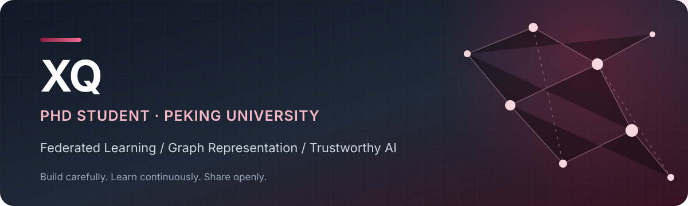

<!-- GitHub Profile README -->

  

  
  
  

## Hi, I'm XQ 👋

I am a PhD student at **Peking University**, interested in building practical and trustworthy machine learning systems. My current work explores the intersection of **federated learning**, **graph representation learning**, and **privacy-preserving computation**.

北京大学在读博士生，关注联邦学习、图表示学习与隐私保护计算，喜欢把研究想法变成清晰、可复现的代码。

## Research interests

| Area | What I care about |
| --- | --- |
| Federated Learning | Collaborative learning across distributed and heterogeneous data |
| Graph Representation Learning | Scalable network embedding and graph-based learning |
| Privacy-Preserving ML | Useful learning systems with responsible data boundaries |
| Natural Language Processing | Representation learning for Chinese language understanding |

## Toolbox

  
  
  
  
  
  
  
  

## Currently

- 🔬 Exploring efficient and privacy-aware learning on distributed graph data
- 📚 Reading about trustworthy machine learning and scalable representation learning
- 🧭 Documenting research ideas, reproducibility notes, and open-source work

---

  Research is the art of making better questions executable.

